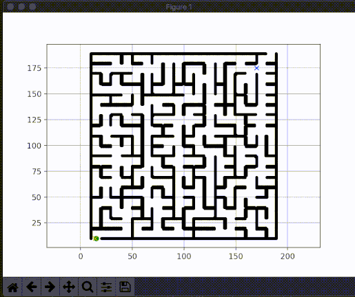

# A* Maze Solver
> Solves mazes with given maze images.

With given input image or a maze, the algorithm uses A* search find a path from the start position to the end position.



## Installation

Clone Repository:

```
$ git clone https://github.com/kangcshin/a-star-maze-solver.git
```

Run:

```
$ python a_star.py
```

## Usage example

Input maze image is named as 'maze.png'. Feel free to replace this image with a new chosen image to solve a new maze.

## Todo
- Automatic selection of start and end positions
